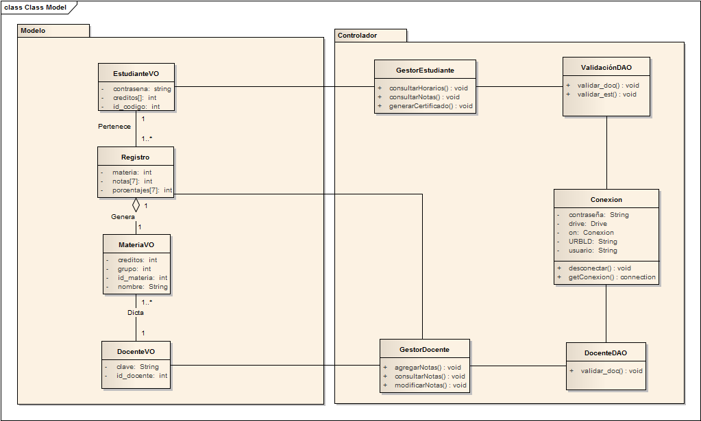
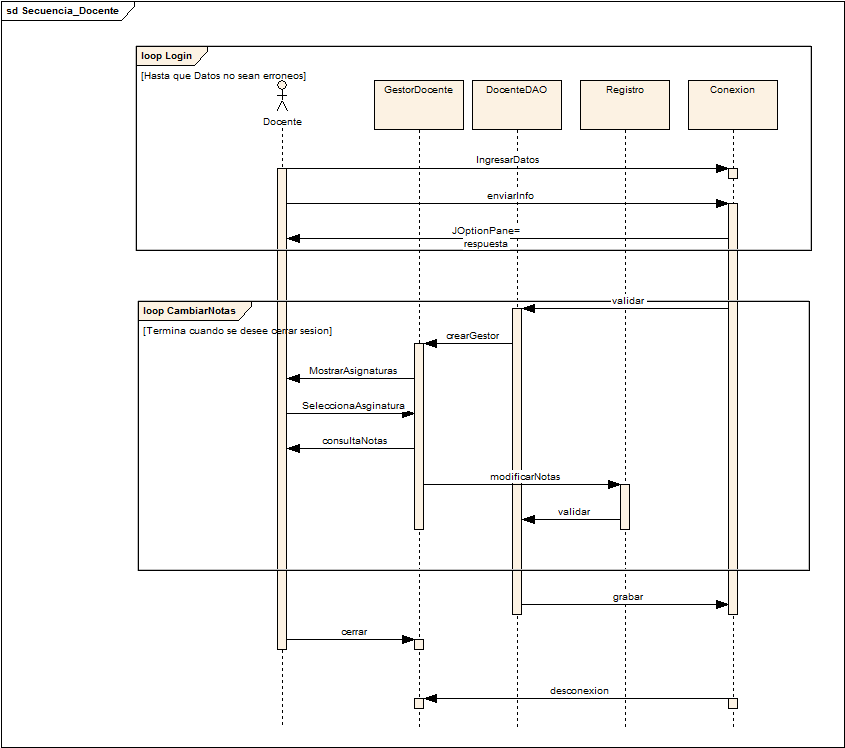
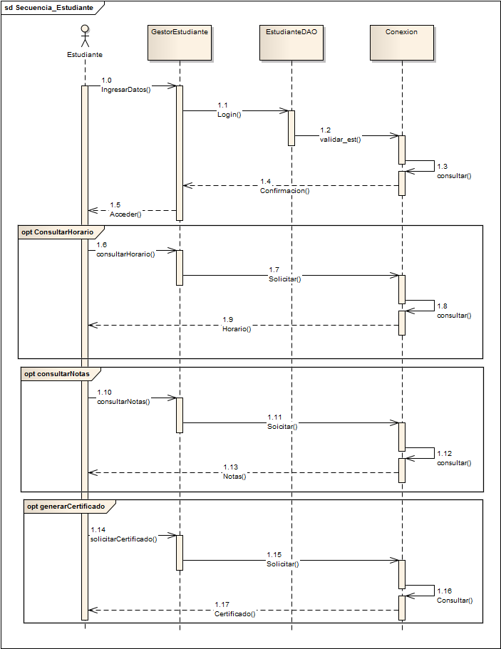
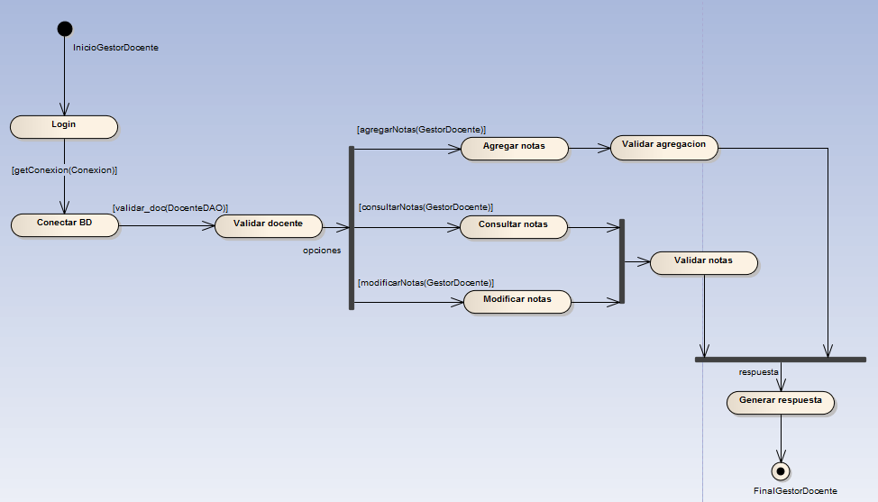
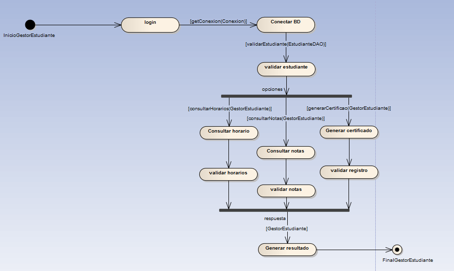
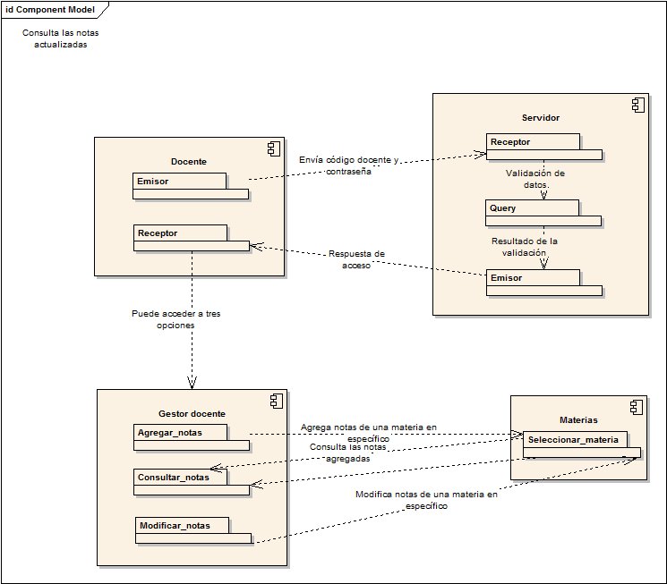
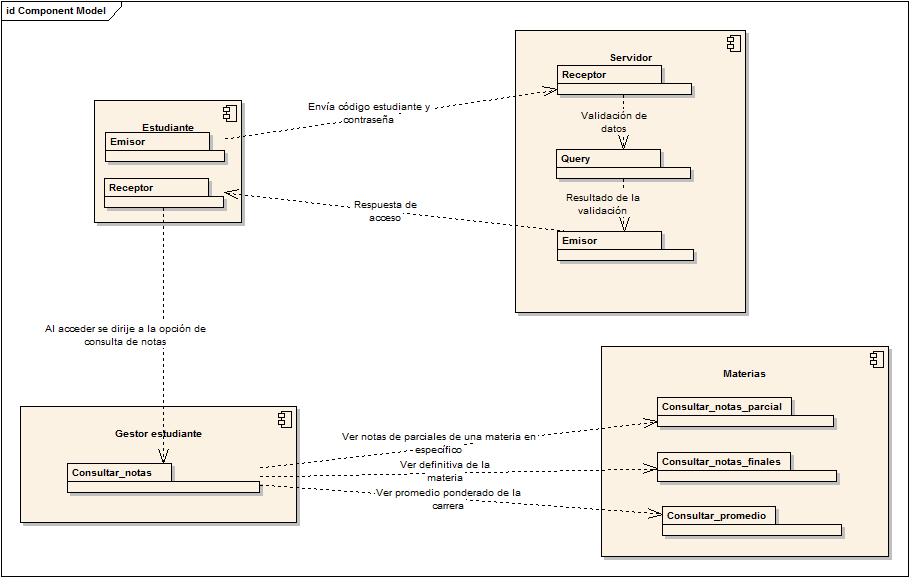

# GestionNotas
Integrantes del grupo: Nicolás Aponte Barrera 20151020069, Luis Felipe Salgado González 20151020087, Gabriela Fernanda Blanco Peña 20151020094 y Brian Alfonso Rodríguez 20151020600

## Diagramas

### Diagrama de paquetes

### Diagrama de secuencias 
### Docente:

### Estudiante:

### Diagrama de estados
### Docente:

### Estudiante:

### Diagrama de componentes
### Docente:

### Estudiante:

